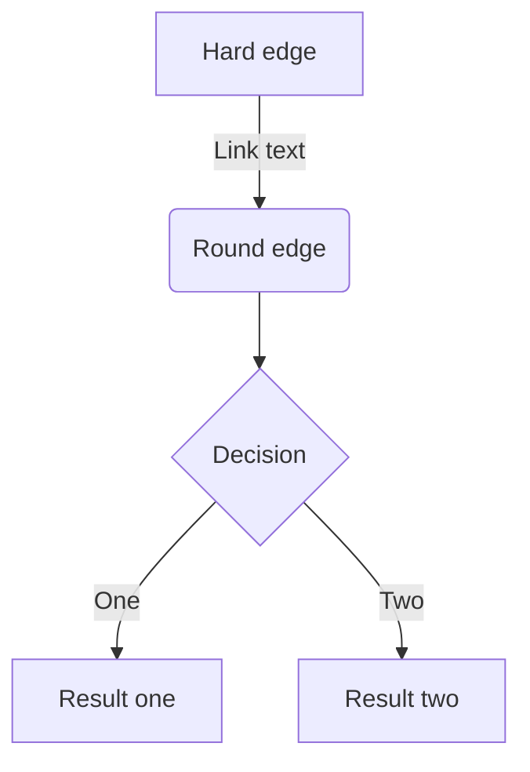

# 随机数
> 新标准c++11  
> 随机数引擎类：生成unsigned整数序列  
> 随机数分布类：使用引擎返回服从特定概率分布的随机数

**c++程序不应该使用库函数rand，而使用default_random_engine类和恰当的分布类对象**  

## 随机数引擎和分布
- 采用引擎+分布生成随机数
- 引擎种子一样每次生成的结果一样，单次生成中可以将引擎和分布设置成静态的就可以不断生成下一个随机值，结果就不一样了
- 随机数发生器，指的是分布对象和引擎对象的组合
- 随机数引擎生成的随机数定义在系统定义的范围内，而rand函数是在0到RAND_MAX
- 设置随机数的种子可以使生成序列不同，一般将种子设为time(0)//从0时间到现在经历多少秒.**time适用于种子的间隔为秒级以上**

例子：
```c
#include <bits/stdc++.h>
#include <unistd.h>

using namespace std;

/*

default_random_engine e;
for(size_t i =0;i<2;i++)
{
  cout<<e()<<" ";
}
*/
int main(int argc, char const * argv[])
{
    static uniform_int_distribution<unsigned> u(0,9);//0到9的均匀分布，static的
    static default_random_engine e(time(0));//time(0)做种子
    cout<<e.min()<<" "<<e.max()<<endl;//引擎的最大值最小值
    for(size_t i =0;i<20;i++)
    {
      cout<<u(e)<<" ";//将引擎作为参数传递给分布
    }
    cout<<endl;
    sleep(1);//暂停一秒，time间隔是秒级以上的种子才有效，#include <unistd.h>
    default_random_engine e1(1);//使用1做种子
    for(size_t i =0;i<20;i++)
    {
      cout<<u(e1)<<" ";
    }
    return 0;
}

```
$f(x)=sin(x)+2  $



